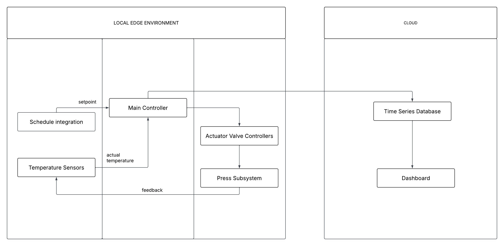

# Steam-Aware Scheduling & Smart Valve Control for Tyre Curing

## Overview

Solid tyre manufacturing relies on **curing presses** that use steam to harden rubber in a hot mould. Steam is wasted on the factory floor in two distinct ways:

1. **Demand peaks** — several presses heating at once spike steam demand, causing boiler pressure dips and extra fuel burn to compensate.
2. **Idle waste** — valves left open on presses with no active job (between batches, during breaks, or breakdowns) because closing them depends on an operator remembering to do it.

This project builds a **schedule-aware valve controller** that smooths demand peaks and automatically shuts off idle valves — cutting wasted steam without slowing production.

## Goal

Demonstrate that a schedule-aware valve controller can reduce wasted steam — both from presses heating simultaneously and from valves left open on idle presses — while still reaching the required curing temperature. This is a **lab-scale simulation and prototype**, not a production control system.

## Problem Context

- A single boiler feeds steam to multiple presses via a shared pipeline; valve control in Sri Lankan factories today is **manual**.
- The curing press cycle has distinct stages: **ramp → cure → cool → idle**.
  - The **ramp stage** has the highest steam demand, since temperature must rise before curing begins.
  - The **curing stage** needs lower but precise steam to hold temperature.
- This project targets **solid tyres** (e.g. "Solid-Tec"), not standard pneumatic tyres. Solid tyres are fully filled (no bladder) and cure far longer (~6–7 hours vs. minutes for pneumatic), which means lower operator attention and greater risk of inefficiency. Target curing temperature is approximately **130°C**.
- **Demand spikes**: simultaneous ramping across presses causes pressure/temperature drops, forcing the boiler to burn more fuel.
- **Idle waste trade-off**: cutting steam during idle risks a temperature drop that costs extra energy to recover on the next ramp; keeping steam on during idle is also wasteful. There is no simple existing solution to this trade-off.
- As a directional benchmark, comparable work in steam optimization reports **10–20% lower boiler fuel use and 15–25% lower CO₂** — if even a fraction of that transfers to tyre curing, the case for this project is strong.

## How It Works

The controller tracks two things at all times: **target curing temperature** and **the production schedule**.

- When multiple presses need to heat, it **staggers and softens valve ramp-ups** to avoid simultaneous peaks.
- When a press has no job (finished, waiting, stopped), it **closes the valve immediately** — no operator dependency.
- Controlling **boiler pressure** is preferred over direct temperature control, since pressure is easier to manage in a vessel and temperature can be derived from it.
- The scheduling engine itself is handled upstream; this system receives the production schedule as an input rather than generating it.

### System Architecture

## System Components

| # | Component | Description |
|---|-----------|--------------|
| 1 | Curing-press digital twin | Software model of a press: temperature profile, steam demand, valve position, and heating/holding/cooling/idle stages. Supports multiple presses running simultaneously. |
| 2 | Smart valve control logic | Decides valve opening based on temperature, schedule, and curing status. Auto-closes valve when idle. |
| 3 | Schedule integration | Reads a production schedule (CSV/JSON) so the controller knows what each press should be doing — and when it should be idle. |
| 4 | Edge prototype + dashboard | ESP32 / Raspberry Pi with simulated valve output, plus a dashboard showing steam use, temperature, and steam saved. |

## Deployment Plan (Factory-Side, Phased to De-Risk)

1. Deploy only temperature sensors first; monitor remotely (Wi-Fi/GSM gateway) for ~5 days to build a real temperature profile.
2. Add valve control to one mould after validating the sensor phase.
3. Expand progressively, addressing edge cases and anomalies along the way.

## Testing Plan

Run the simulator under ordinary control vs. smart control and compare steam use:

- **Peak test** — multiple presses heating together; smart control should give a lower, smoother steam peak while still hitting target temperature.
- **Idle test** — a press finishes with no next job; compare valve-left-open vs. auto-close, and measure steam saved.
- **Full shift test** — total steam used over a full shift, ordinary vs. smart control, combining both effects.

## Timeline

| Phase | Focus |
|-------|-------|
| Weeks 1–2 | Learn the tyre curing process; agree scope and requirements *(current)* |
| Weeks 3–6 | Build the digital twin and basic temperature (PID) control |
| Weeks 7–9 | Add schedule input, peak smoothing, and idle valve shut-off |
| Weeks 10–12 | Build edge prototype and dashboard; run test scenarios |
| Weeks 13–14 | Compare results, write report, present findings |

## Project Log

**July 9, 2026 — Supervisor Meeting #1 (Dr. Sulochana):** Project scope confirmed with the supervisor.

**July 10, 2026 — Review Meeting #1 / Project Kickoff:**
- Reviewed tyre manufacturing and curing process fundamentals.
- Confirmed solid-tyre focus and the demand-peak / idle-waste problem framing.
- Agreed on a phased factory deployment approach (sensors → single valve → full expansion).
- **Action items:**
  - Share project workspace with the supervisor
  - Present process understanding and a block diagram on the next call
  - Prepare a rough hardware list
  - Begin control algorithm work from mid-July through the first week of August (simulated data, no hardware needed yet)
  - Supervisor to handle hardware purchasing and bring hardware to Sri Lanka by end of August
  - Recurring bi-weekly call slot scheduled via WhatsApp
- Documentation and implementation are to proceed **in parallel** to avoid duplicated effort at presentation time.

## Notes

This project follows a lab-scale simulation-first approach: the control algorithm and digital twin are developed and validated in simulation before any physical hardware is introduced (hardware arrives end of August 2026). AI tools are used to assist with code generation, with an emphasis on understanding all generated code.
